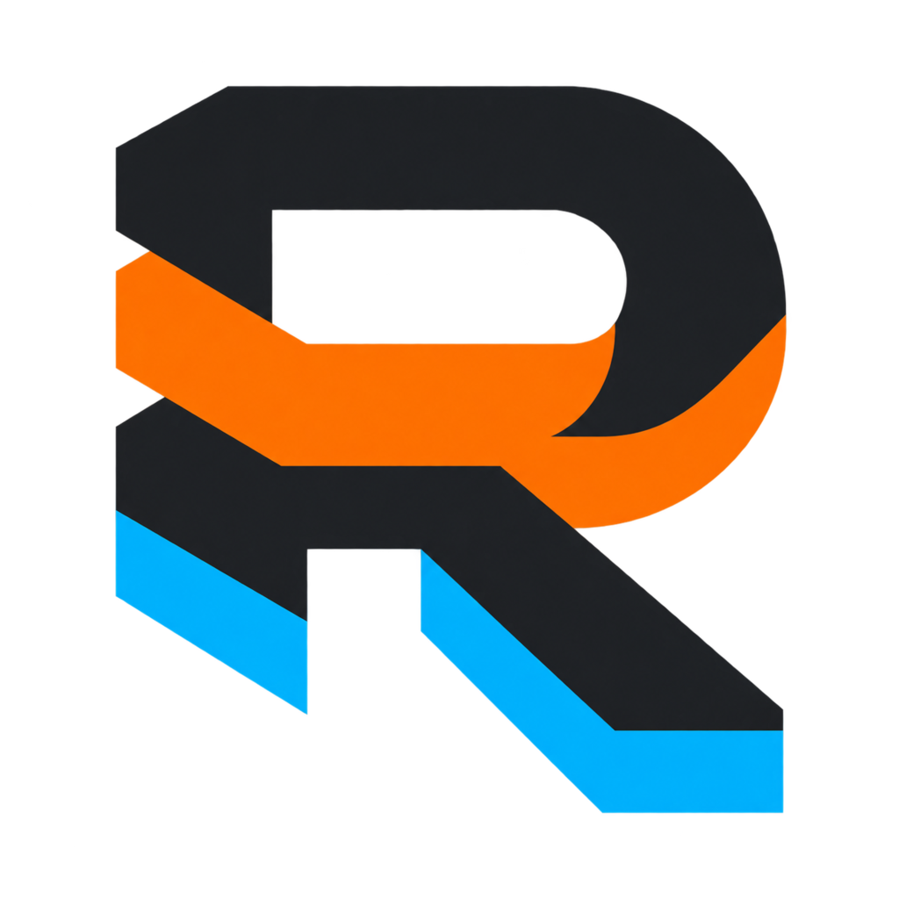

# R-Stack



R-Stack is a host-neutral engineering workflow for capable coding agents. Its
job is not to compensate for an incapable executor. It prevents repeatable
workflow failures: premature coding, anchoring on the user's diagnosis, narrow
tests, scope drift, unsafe parallel writes, stale proof, false completion, and
lossy session pickup.

Use `$r-stack-mode` as the front door for non-trivial engineering work. It
aligns on the outcome, selects one playbook, loads only the techniques that
playbook needs, and closes against fresh evidence. The operator or harness owns
executor configuration; R-Stack never selects or recommends it.

## Cursor

Install as a local Cursor plugin (Cursor skips symlinks that point outside
`~/.cursor/plugins/local`, so this is a real copy):

```bash
~/plugins/r-stack/scripts/install-cursor.sh
```

Then reload the window (`Developer: Reload Window`). Confirm **r-stack** under
Customize → Plugins. Slash commands: `/r-stack`, `/investigate`, `/verify`,
`/review`.

## How it is organized

- [`WORK_PROFILE.md`](WORK_PROFILE.md) holds stable personal engineering
  preferences.
- [`r-stack-mode`](skills/r-stack-mode/SKILL.md) routes the task and enforces
  alignment, rigor, orchestration boundaries, and completion.
- Project `AGENTS.md` files remain authoritative for local architecture,
  commands, permissions, and delivery policy.
- Project overlays add repository-specific verification without forking the
  general workflow.

## Skills

| Skill | Responsibility |
| --- | --- |
| `r-stack-mode` | Route the task and enforce phase gates. |
| `investigate` | Trace mechanics, history, and falsifiable causes. |
| `shape` | Resolve decision dependencies and domain meaning. |
| `architect` | Settle caller usage, state ownership, interfaces, and seams. |
| `prototype` | Answer one design question with a disposable experiment. |
| `orchestrate` | Partition work, assign one writer, and reconcile receipts. |
| `verify` | Map acceptance claims to fresh consequential-path evidence. |
| `review` | Independently assess intent, engineering, and proof. |
| `resume` | Reconcile summaries with live state and continue exactly once. |
| `reflect` | Promote repeated failures into the narrowest effective control. |
| `workflow-eval` | Compare workflow variants under isolated, blinded runs. |

## Playbooks

The router contains fourteen playbooks:

1. investigation
2. shaping
3. design
4. plan
5. bug fix
6. feature
7. refactor
8. performance
9. prototype
10. operational change
11. review
12. resume
13. long run
14. workflow evaluation

`resume` and `long run` can modify another primary playbook. Rigor scales from
Direct to Deliberate to Program according to uncertainty, reversibility, and
impact—not task size alone.

## Parallel work contract

R-Stack uses stable decision, acceptance, work, and evidence identifiers
(`D-###`, `A-###`, `W-###`, `E-###`). The coordinator owns decomposition,
dependencies, write ownership, pilot selection, evidence checking, synthesis,
and the final verdict. Workers return structured receipts; their claims are not
accepted until the coordinator checks the cited artifact and final diff.

The included validators reject dependency cycles, unordered write conflicts,
missing acceptance-to-proof mappings, incomplete receipts, stale fingerprints,
and executor-policy fields in a work graph.

## Status

This is v0. The structure and validators are usable, but broad superiority is
not claimed from a single smoke case. Promote workflow changes only after the
blinded evaluation playbook passes across repeated representative tasks.

See [`UPSTREAM.md`](UPSTREAM.md) for the exact PStack and Matt Pocock source
revisions and licenses used as design inputs.
